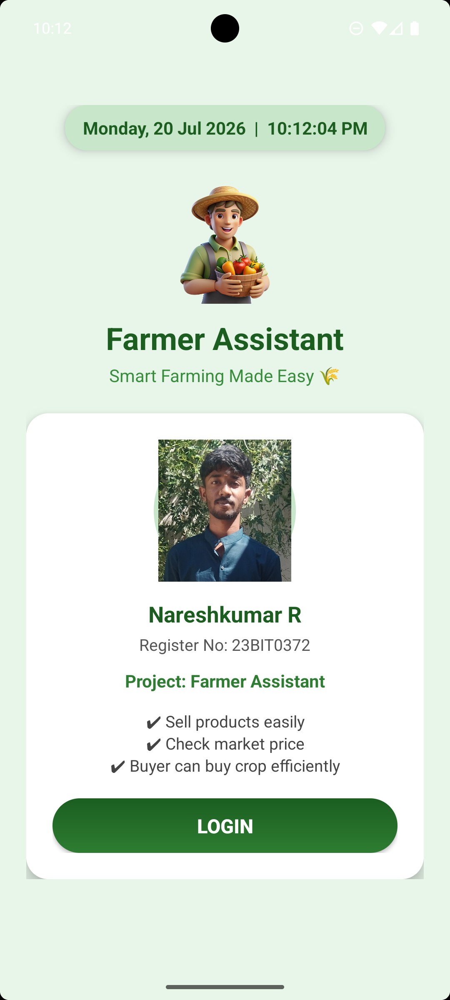
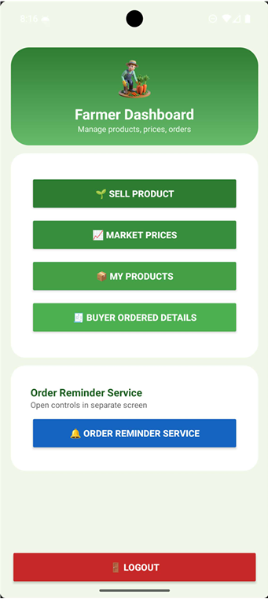
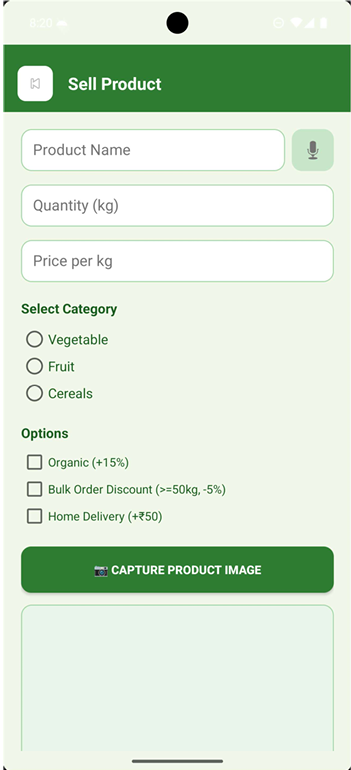
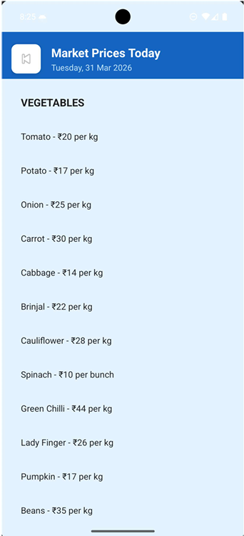
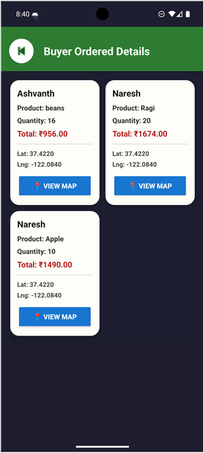

# 🌾 Farmer Assistant

An Android application that enables farmers to sell agricultural products directly to buyers, check market prices, manage orders, and navigate delivery locations using Google Maps.

## 📱 Project Overview

Farmer Assistant is a mobile application developed as part of the **Mobile Application Development** course. The application bridges the gap between farmers and buyers by allowing direct product sales without intermediaries. It also provides market price information to help farmers make informed selling decisions.

---

## ✨ Features

- 🔐 Farmer & Buyer Login/Signup
- 🌱 Sell agricultural products
- 🛒 Browse and purchase products
- 📦 Manage products and orders
- 💰 View market prices
- 🗺️ Google Maps integration for navigation
- 📍 Location-based order tracking
- 🔔 Order reminder notifications
- ☁️ Firebase Firestore integration
- 💾 SQLite local database
- 🎤 Voice input support
- 📷 Camera support for product images

---

## 🛠️ Technologies Used

- **Language:** Java
- **IDE:** Android Studio
- **UI:** XML
- **Local Database:** SQLite
- **Cloud Database:** Firebase Firestore
- **Maps:** Google Maps
- **Build Tool:** Gradle

---

## 📂 Project Structure

```
FarmerAssistant
│── app/
│── gradle/
│── gradlew
│── gradlew.bat
│── settings.gradle.kts
│── build.gradle.kts
└── README.md
```

---

## 🚀 Installation

1. Clone the repository

```bash
git clone https://github.com/nareshkumar0372/Farmer-Assistant.git
```

2. Open the project in Android Studio.

3. Add your `google-services.json` file inside the `app/` folder.

4. Sync the Gradle project.

5. Run the application on an Android device or emulator.

---

## 📸 Application Screenshots

| Welcome | Login |
|---------|-------|
|  |  |

| Dashboard | Sell Product |
|-----------|--------------|
|  |  |

| Market Price | Orders |
|--------------|--------|
|  |  |

---

## 🔮 Future Enhancements

- Online payment integration
- Product search and filtering
- Chat between farmers and buyers
- AI-based crop price prediction
- Weather forecasting
- Multi-language support

---

## 👨‍💻 Author

**Nareshkumar R**

- GitHub: https://github.com/nareshkumar0372
