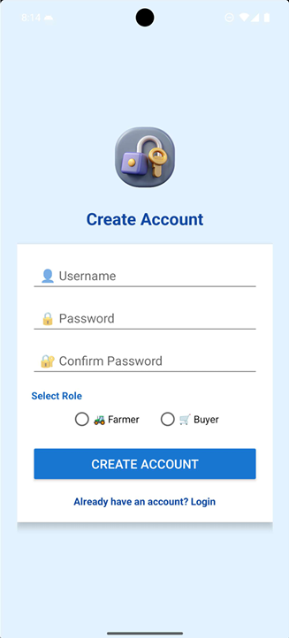
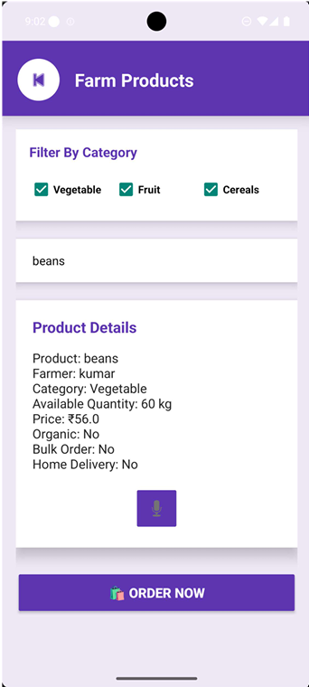
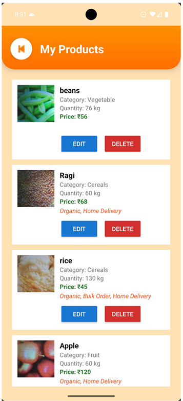
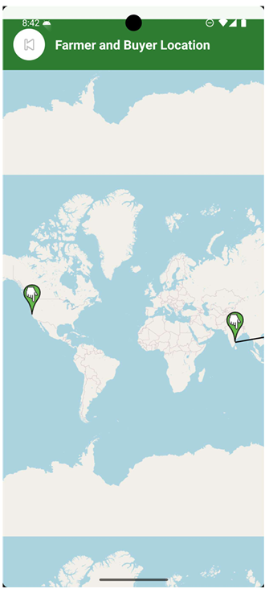

# 🌾 Farmer Assistant

<p align="center">
  
  
  
  
  
</p>

## 📖 Overview

Farmer Assistant is an Android application developed to help farmers sell agricultural products directly to buyers without intermediaries. The application also provides market price information, order management, and location-based services using Google Maps.

---

## ✨ Features

- 👨‍🌾 Farmer Registration & Login
- 🛒 Buyer Registration & Login
- 🌱 Sell Agricultural Products
- 📦 Browse Available Products
- 📋 Order Management
- 💰 Live Market Price Information
- 📍 Google Maps Integration
- 🔔 Order Notifications
- ☁️ Firebase Firestore
- 💾 SQLite Database
- 🎤 Voice Input
- 📷 Camera Support

---

## 🛠️ Technologies Used

| Technology | Purpose |
|------------|---------|
| Java | Android Application Development |
| XML | User Interface |
| SQLite | Local Database |
| Firebase Firestore | Cloud Database |
| Google Maps API | Navigation |
| Android Studio | Development Environment |
| Gradle | Build Tool |

---

# 📱 Application Screenshots

| Welcome Screen | Login Screen |
|:--------------:|:------------:|
|  |  |

| Signup Screen | Farmer Dashboard |
|:-------------:|:----------------:|
|  |  |

| Sell Product | Browse Products |
|:------------:|:---------------:|
|  |  |

| Market Price | My Products |
|:------------:|:-----------:|
|  |  |

| Orders | Google Maps |
|:------:|:-----------:|
|  |  |

---

## 📂 Project Structure

```
FarmerAssistant
│
├── app/
├── gradle/
├── screenshots/
├── README.md
├── gradlew
├── gradlew.bat
├── settings.gradle.kts
└── build.gradle.kts
```

---

## 🚀 Installation

1. Clone the repository

```bash
git clone https://github.com/nareshkumar0372/Farmer-Assistant.git
```

2. Open in Android Studio.

3. Add your own `google-services.json` inside the `app/` folder.

4. Sync Gradle.

5. Run the application on an Android device or emulator.

---

## 🔮 Future Enhancements

- 💳 Online Payment Gateway
- 🤖 AI-based Crop Price Prediction
- 💬 Farmer-Buyer Chat System
- 🌦️ Weather Forecast Integration
- 🌍 Multi-language Support
- 📈 Sales Analytics Dashboard

---

## 👨‍💻 Author

**Naresh Kumar R**

- GitHub: https://github.com/nareshkumar0372

---

## 📄 License

This project was developed for educational purposes as part of the **Mobile Application Development Course**.

⭐ If you like this project, don't forget to **Star** the repository.
